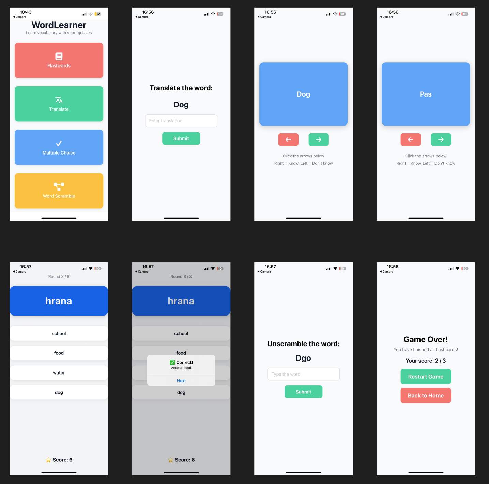

# WordLearner

**WordLearner** is a React Native application designed to help users expand their vocabulary and improve language skills through fun and interactive games.  
The app makes learning new words engaging and effective.  

##  Games
1. **Flashcards** – review and memorize words quickly with flashcards.  
2. **Translate** – translate the displayed word into the correct language.  
3. **Match the Pairs** – connect words with their correct translations.  
4. **Unscramble the Word** – rearrange scrambled letters to form the correct word.  

## Technologies & Libraries
- React Native – framework for building mobile applications  
- Expo – used for fast development and testing  
- Zustand – simple and efficient state management  

##  Screenshots

Here is an example of the app:

